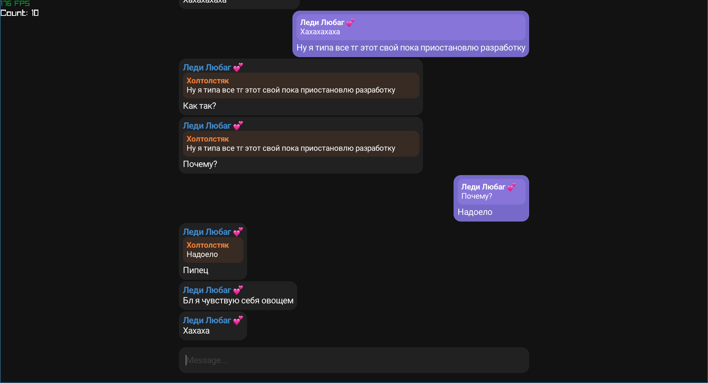

> [!WARNING]
> The project is unfinished
> STG is created for my own use => it is not perfect

# Preview

<p align=center>
  
</p>

## Build

Clone the project

``` console
$ git clone --recursive https://github.com/kototuz/stg.git
```
or
``` console
$ git clone --recurse-submodules https://github.com/kototuz/stg.git
```

Go to the project directory and build it

``` console
$ make API_ID=<your_api_id> API_HASH=<your_api_hash>
```

Run

``` console
$ ./build/stg
```

## Description

Available *stg* commands that you can type in the editor:
- `:c` - print chats in terminal
- `:sc <chat_id>` - select chat
- `:l` - logout

You also can type emoji unicodes by using `:<unicode>:`

All customization is located in `src/config.h`
